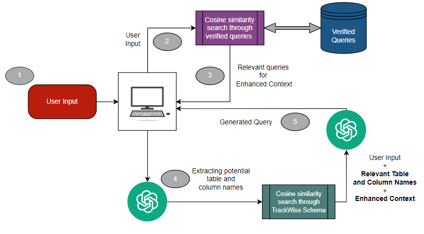

# trackwise-search

trackwise-search is an NLP to SQL tool for the TrackWise Oracle SQL Database by converting natural language prompts to Oracle SQL queries which directly run on the TrackWise database. The extracted data can then be exported directly as an Excel file to local storage.

## Quickstart
1. Clone repo
   ```sh
    git clone https://github.com/mattlimsiaco/trackwise-search.git
   ```
2. Start virtual environment
   ```sh
   python -m venv venv
   ```
3. Activate virtual environment
   ```sh
   .\venv\Scripts\activate
   ```
4. Install dependencies
   ```sh
    pip install -r requirements.txt
   ```
5. Connect to repo
   ```sh
    git remote set-url origin https://github.com/mattlimsiaco/trackwise-search.git
   ```
6. Set Flask app
   ```sh
    $env:FLASK_APP = "app.py"
   ```
7. ***IMPORTANT! Refer to #2 in "Important Notes and Future Implementations" before continuing!***
   ```sh
    flask run
   ```

## Features


1. **QUERY Tab**
   - **Natural Language Querying:** Enter a natural language prompt in the chatbox to generate a SQL query tailored for the TrackWise Oracle SQL database.
   - **Query Verification:** Review and confirm the generated query by checking the verification box. Both the user input and the generated query, along with their vector embeddings, are stored in the backend for future reference.

2. **DATA Tab**
   - **Data Preview:** View a snapshot of the data extracted by executing the generated query on the TrackWise database.
   - **Export Functionality:** Use the "Export Data" button to save the extracted data locally as an Excel file.

3. **Tooltips**
   - **Usage Guidance:** Access tooltips that offer insights into using the app effectively and optimizing results by providing specific prompt guidelines.

4. **Update Data**
   - **Database Synchronization:** Update the table and column names to reflect the latest TrackWise schema format, ensuring your data remains current and accurate.


### Query Generation Functionality



1. **User Input**
   - **Input Handling:** User input is captured and sent to the backend for processing.

2. **Similarity Search Through Verified Queries**
   - **Vector Embedding:** Convert user input into a vector embedding using AzureOpenAIEmbeddings.
   - **Find Similar Queries:** Identify the K most similar queries from the verified query database.
     - **NOTE:** Currently, verified queries (including user queries, generated SQL queries, and their embeddings) are stored in a JSONL file. For improved scalability and efficiency, consider storing them in a vector database.

3. **Retrieval of Most Similar Queries**
   - **Enhanced Context:** Return the K most similar queries as **Enhanced Context** for further processing.

4. **Extracting Relevant Tables and Columns**
   - **Determine Tables and Columns:** OpenAI suggests a list of potential tables and columns based on the user's input.
   - **Match with TrackWise Schema:** Locate the actual table names in the TrackWise schema (stored as a CSV file containing vector embeddings of table names, columns, and data types) using cosine similarity search.
     - **NOTE:** The local storage of the TrackWise schema is not ideal. For better performance, consider using a cloud-based vector database such as Azure.
   - **Refine Column Selection:** Apply the same process to find relevant columns, limited to the identified tables.
   - **Model Context Enhancement:** Feed the K most relevant table and column names into the OpenAI context. 
   - **Retrieval Augmented Generation:** Implement Retrieval Augmented Generation with the **Enhanced Context** to improve query generation. 
     - **NOTE:** Providing a reduced scope with the most relevant table and column names is more efficient than searching the entire TrackWise schema. Previous methods using LangChain took around 50-60 seconds for this process.

5. **Query Generation**
   - **Generate Query:** Using the base prompt, user input, relevant table and column names, and the enhanced context, the model generates the final Oracle SQL query.


## Important Notes and Future Implementations

1. **METHOD FOR QUERY GENERATION:**
   - The backend is currently being run through 2 iterations of OpenAI: 
     1. First to extract potential table and column names, 
     2. Second to finally generate the query. 
   - I have yet to discover a more efficient method of extracting potential table and column names. However, without the double implementation, I assume there will be a reduction in the cost of upkeep with the usage of OpenAI's API. There may also be a decrease in runtime if parsing/extraction is done manually.
   - **My original method:** Utilize LangChain to automatically run steps 4 and 5 in the "Query Generation" visualization. LangChain would directly connect to the TW Oracle SQL database and generate a query after finding the respective table names and column names. While this seems simple, it resulted in significantly long runtimes, averaging 50-60 seconds, and lacked the ability to tweak the efficiency.

2. **ENVIRONMENT VARIABLES:**
   - Due to privacy policy, the `.env` file, which contains all the environment variables, cannot be pushed directly to GitHub. The most practical and foolproof method is to use this template to fill out the variable values and then save it as `.env` in the root directory of the project folder:

     ```
     AZURE_OAI_TYPE = "azure"
     AZURE_OAI_VERSION = "2024-02-01"
     AZURE_OAI_ENDPOINT = "https://strykeranalyticsopenai.openai.azure.com/"
     AZURE_OAI_KEY = 
     AZURE_OAI_CHAT = "gpt-35-turbo"
     AZURE_OAI_EMBEDDING = "stryker_embedding_ai"

     ORACLE_DB = 
     ORACLE_HOST = 
     ORACLE_PORT = 
     ORACLE_USERNAME = 
     ORACLE_PASSWORD = 
     ```
   - The `AZURE_OAI_KEY` can be found in the Azure portal, under the OpenAI service. The best alternative is to store them as secrets within Azure and automate an access pattern to generate a `.env` file automatically.

3. **VECTOR DATABASE STORAGE:**
   - Currently, the vector embeddings for the TW Database schema and verified queries are stored as a CSV and JSONL file, respectively. These should instead be stored in established vector databases (preferably within Azure) and utilized as index tables for cosine similarity search.
   - While this may decrease the runtime of the app, it mitigates a lot of problems related to local storage, scalability, and deployment.

4. **UPDATE DATA BUTTON:**
   - The "Update Data" button is completely free to use by anybody. This is a problem if the app is running on a web server, since pressing the button without letting it complete fully (which takes on average 10 minutes) results in an incomplete TW database schema. All table and column vector embeddings are cleared initially and then filled according to the TW database metadata. This results in the app being non-functional if the user requests data that is not part of the TW database schema.
   - Some alternatives could be to implement admin access to this button or simply remove the button entirely and update the metadata exclusively through the backend in the case that the TW database gets updated.


## DEPLOYMENT
***AZURE WEB APP DEPLOYMENT***
I have attempted to deploy on Azure as a web app (both with methods through GitHub Actions and Docker), however I came across the problem that Stryker firewall prevents connection to the TW Oracle SQL since it is being hosted virtually. As a potential solution, I sucessfully deployed the app under the already established virtual network within the StrykerAnalytics resource group. I could not directly verify that the virtual network was the solution, however, since I received this error:
```sh
 cx_Oracle.DatabaseError: DPI-1047: Cannot locate a 64-bit Oracle Client library
```
I reached 2 solutions:
1. Directly install the 64-bit Oracle Client library to the Azure web app or download it directly within the local app's root directory. After attempting both methods of installation, the error still remained whenever running the app.
2. Attempt to deploy through the same resource group's virtual machine. I unfortunately could not come to a solution of accomplishing this.

***PYINSTALLER DEPLOYMENT***
To avoid the issue of the Oracle Client and Stryker's firewall, I also looked into local deployment, directly running the Flask app without a Python interpreter. This method would provide a simple .exe file to run the app locally and should bypass any issues with connecting with the Oracle SQL database, as long as the device is connected to the VPN. I have spent quite some time debugging this method since it requires a lot of fine-tuning according to how your Flask app works. This method, however, presented more problems such as:
1. Since the entire project folder is condensed into a single exe file, referencing and updating the csv and jsonl files for the TW schema and verified queries requires temporary paths to be created to these data sources.
2. Since it would be local deployment, the verified queries storage would not be synced with other users, so growth of the "TrackWise knowledge" would be entirely based on how often the single user utilizes the app.
